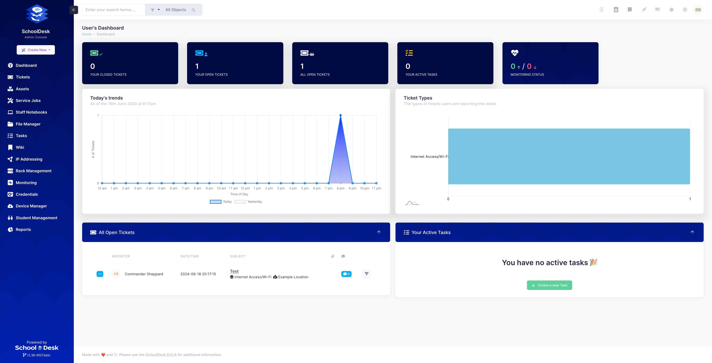

# About SchoolDesk

SchoolDesk is a simple Helpdesk System for School IT Teams.

SchoolDesk provides many features such as

- Intuitive and Fast Interface with Mobile/Tablet Support.
- Easy Ticketing System with Comment and Email Piping support.
- Asset System with support for Teacher Notebook Program devices.
- Service Job functionality for tracking 1:1 BYOD Repairs and other Repair Tasks.
- File Manager for storing documents central to your IT department securely.
- Tasks System with automated Reminders and Sharing Functionality.
- Staff Portal for Reporting Maintenance/Cleaning/OHS Issues at your School. These can be managed by your Facilities Team.
- Timesheet Calendar for assistance with generating timesheet or billable items based on Tickets.
- IP Address, Rack Infrastructure and Credential Management. Store your subnets, rack details and passwords securely.
- Kiosk Support with assisted Password Resets. Also provides Printer Code and Balance Integration via Papercut.
- Interoptability with Active Directory for integration with on-site domains.
- LDAP Integration for Staff Single-Sign On and importing of Students for Password Resets.
- Quick and simple push/email notifications including Slack, Telegram and Pushover.
- And many other features not listed here.

Visit https://schooldesk.education for more information.